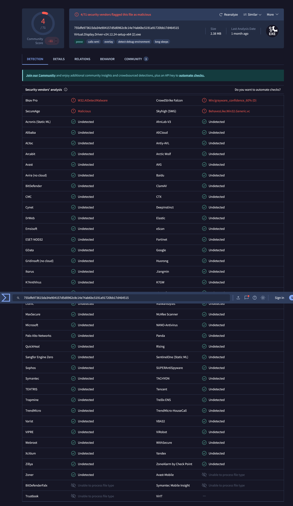

#  Virtual Display Driver – Compatibility Fork

This is a **compatibility-focused fork** of the Virtual Display Driver (VDD), based on an **older, more stable version** that works reliably in environments where the latest release fails especially on **virtualized setups like Tensordock**.

---

### 🎯 Purpose

This driver creates a _virtual monitor_ in Windows that behaves exactly like a physical display. It’s particularly useful for:

- **Streaming setups**  
- **Virtual Reality & Remote Desktop**  
- **Screen recording tools**  
- **Headless servers** (no physical display attached)  

Unlike real monitors, this virtual driver supports:

- Custom resolutions & refresh rates  
- EDID emulation (simulate specific monitor models)  
- Flexible multi-monitor arrangements on any Windows system  

---

### ⚠️ Why this Fork?

I’m providing this **older version** because some users, especially on **Tensordock VMs** have reported that the newest release isn’t recognized properly after installation. This build resolves that issue and installs reliably in those environments.

---

### 🧪 VirusTotal Scan Results



I scanned the installer on [VirusTotal](https://virustotal.com), and here’s what I found:

- ✅ **67 out of 71 AV engines marked it clean**  
- ⚠️ **4 vendors flagged it**:
  - `W32.AIDetectMalware` – Bkav Pro  
  - `Malicious` – SecureAge  
  - `Win/grayware_confidence_60%` – CrowdStrike Falcon  
  - `BehavesLike.Win32.Generic.vc` – Skyhigh (SWG)

These are **false positives**, likely caused by:
- WMI/debug-like behaviors (overlay detection, long sleeps)  
- No digital signature (common in niche tools)  

---

### 🔐 What You Should Know

- 🧠 The file is **unmodified**, sourced from [ItsMikeTheTech](https://github.com/itsmikethetech)
- 🔒 SHA256: 755DFE973615DA34E904157D5D0962C8C14E74AB6BC5191A91720BB17D464515
- 💡 Feel free to **scan or analyze** it yourself  
- 🛡️ Most major AV tools (incl. Defender) report it as safe  

> I’m releasing this version for compatibility only—use it at your own discretion and verify if unsure.

---

| 👤 Developer | 🏷️ Role                             | 💖 Support Us |
|-------------|--------------------------------------|--------------|
| **[MikeTheTech](https://github.com/itsmikethetech)** | Project Manager & Lead Programmer | [Patreon](https://www.patreon.com/mikethetech) / [GitHub Sponsors](https://github.com/sponsors/itsmikethetech) |
| **[Jocke](https://github.com/zjoasan)** | Programmer & Concept Designer | [GitHub Sponsors](https://github.com/sponsors/zjoasan) |

> 💡 Your support helps us continue to build awesome tools!

---

## ⬇️ Download The Compatibility Version

- **[Installer for Windows 10/11](https://github.com/https://github.com/ULTRA-VAGUE/Virtual-Display-Driver-Compatibility-Fork/releases)**

Check the [Releases](https://github.com/ULTRA-VAGUE/Virtual-Display-Driver-Compatibility-Fork/releases) page for the latest version and changelog.

> [!IMPORTANT]  
> Before installing, ensure the **Microsoft Visual C++ Redistributable** is installed.  
> If you see `vcruntime140.dll not found`, download the latest version from [Microsoft’s official page](https://learn.microsoft.com/cpp/windows/latest-supported-vc-redist).

---

## 🛠️ Installation

1. Download the installer from the [Releases] page.  
2. Run the executable and follow the on-screen instructions.  
3. (Optional) Confirm installation:
   - Open **Device Manager** → check under **Display Adapters**  
   - Open **Settings** → see if virtual monitors are listed  

Manual installation steps are available in the wiki.

---

## 🤔 Compatibility Compared to Other Indirect Display Drivers

Here’s how this fork compares with other popular Idd/virtual display solutions:


¹ ARM64 support on Win11 24H2+ may require test-signing to be enabled.  
HDR support available for Windows 11 23H2+.

---

## ▶️ Videos & Tutorials

### Installation Walkthrough  
[](https://youtu.be/ChvucKHbwMo)

### Configuration Guide  


---

## 🤝 Sponsors

<table>
  <tr>
    <td></td>
    <td>Free code signing provided by <a href="https://signpath.io">SignPath.io</a> / Certificate by <a href="https://signpath.org">SignPath Foundation</a></td>
  </tr>
</table>

---

## Acknowledgements

- **[MikeTheTech](https://github.com/itsmikethetech)** – Project lead & core dev  
- **[zjoasan](https://github.com/zjoasan)** – Programmation & EDID support  
- **[Bud](https://github.com/bud3699)** – Former lead dev  
- **[Roshkins](https://github.com/roshkins/IddSampleDriver)** – Original repo  
- **[Baloukj](https://github.com/baloukj/IddSampleDriver)** – 8‑bit/10‑bit color support  
- **[Anakngtokwa](https://github.com/Anakngtokwa)** – EDID sourcing  
- **[Microsoft](https://github.com/microsoft/Windows-driver-samples/tree/master/video/IndirectDisplay)** – Sample driver  
- **[AKATrevorJay](https://github.com/akatrevorjay/edid-generator)** – Hi-res EDID tool  
- **[LexTrack](https://github.com/lextrack/)** – MiniScreenRecorder script  

---

## 📈 Star History

[](https://www.star-history.com/#VirtualDrivers/Virtual-Display-Driver&Date)

---

## Disclaimer

This software is provided **“AS IS”**, with **no warranties**. While it has worked reliably in my and many others’ setups, there's no guarantee it won't cause issues. It runs in **User Mode (Session 0)**, reducing risk of system instability (e.g. BSOD), but please use with caution.
```
